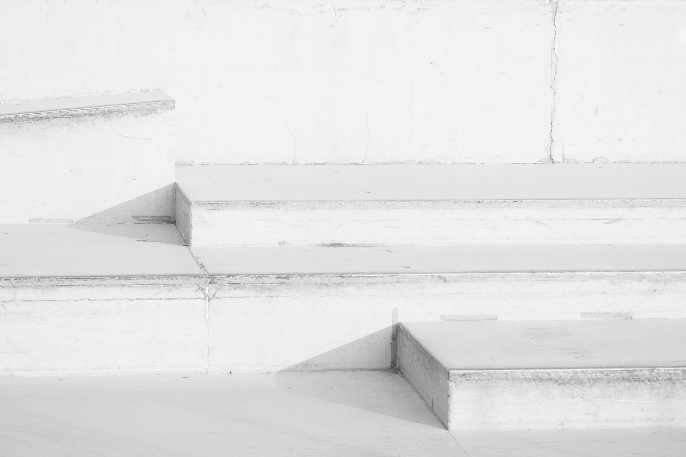
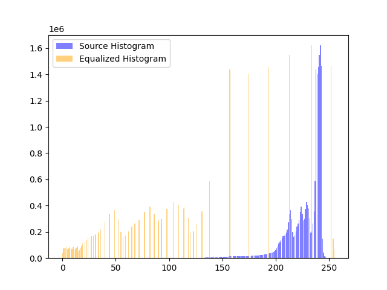
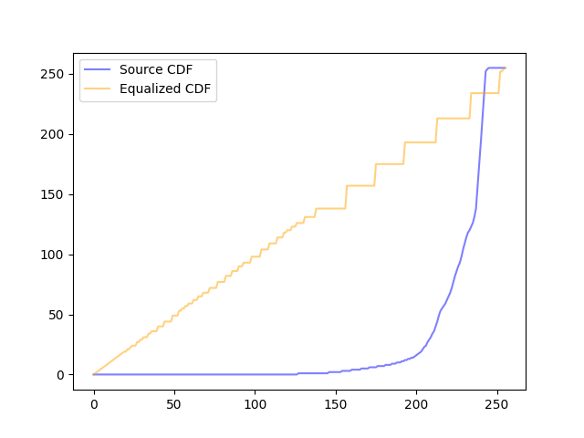
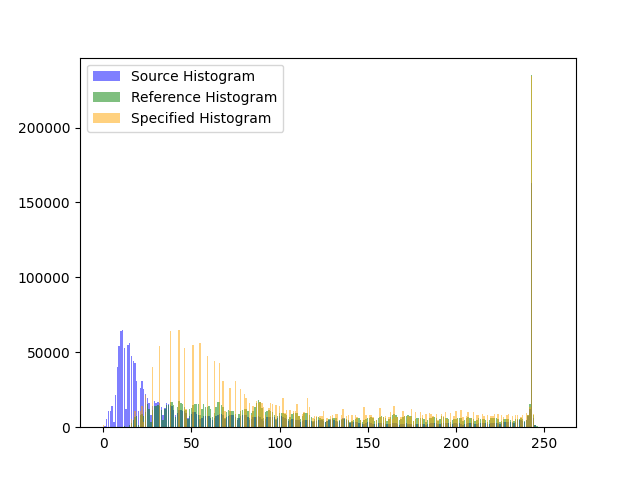
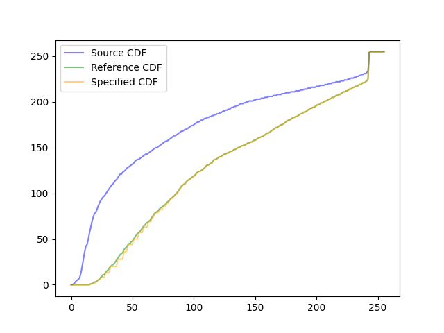

# HW2 REPORT
110511010 楊育陞

## 1. Method

### 1.1. Histogram Equalization

1. 計算原圖的直方圖
2. 計算原圖的CDF，並將其normalize
3. 透過CDF將原圖的pixel值轉換成新的pixel值

```python
def histogram_equalization(img):
    hist = compute_histogram(img)
    cdf = compute_cdf(hist, img)
    img2 = np.zeros_like(img)
    img2 = cdf[img]
    return img2
```

### 1.2. Histogram Specification

1. 計算source和reference的CDF
2. 找出source和reference的CDF之間的mapping：對於每個source的CDF值，找出最接近的reference的CDF值中的index最小者。
3. 透過mapping將source的pixel值轉換成新的pixel值
```python
def gen_spec_map(cdf_ref):
    ref_map = np.zeros(256)
    for i in range(256):
        ref_map[i] = np.argmin(np.abs(cdf_ref - i))
    return ref_map

def histogram_specification(img, ref):
    hist_source = compute_histogram(img)
    cdf_source = compute_cdf(hist_source, img)
    hist_ref = compute_histogram(ref)
    cdf_ref = compute_cdf(hist_ref, ref)
    ref_map = gen_spec_map(cdf_ref)
    img2 = np.zeros_like(img)
    for i in range(img.shape[0]):
        for j in range(img.shape[1]):
            img2[i, j] = ref_map[cdf_source[img[i, j]]]
    return img2
```

## 2. Results

### 2.1. Histogram Equalization

<div style="display: flex;">
    
    
</div>
<p align="center">Figure 1: Source Image (left) and Equalized Image (right)</p>

<div style="display: flex;">
    
    
</div>
<p align="center">Figure 2: Histograms (left) and CDFs (right) of Source/Equalized Image</p>

### 2.2. Histogram Specification

<div style="display: flex;">
    
    
    
</div>
<p align="center">Figure 3: Source Image (left), Reference Image (middle), and Specified Image (right)</p>

<div style="display: flex;">
    
    
</div>
<p align="center">Figure 4: Histograms (left) and CDFs (right) of Source/Reference/Specified Image</p>

## 3. Feedback
我認為在這種直方圖轉換的影像處理，如果有幾個正確的結果圖片可以參考，會更有助於我們了解程式的正確性。儘管如此，我在試錯的過程中，也學到了許多特別的東西，例如我為了將結果正確性做視覺化，印出了直方圖與CDF，結果發現因為我原本將結果圖片存為JPEG，導致圖片在壓縮後的直方圖與CDF有所變化，導致我以為程式有誤，後來換成PNG無損壓縮後，才發現我原本的程式是正確的。
